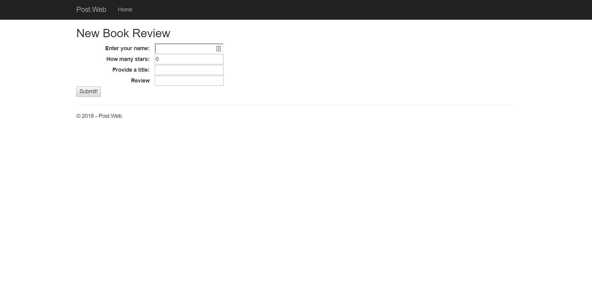
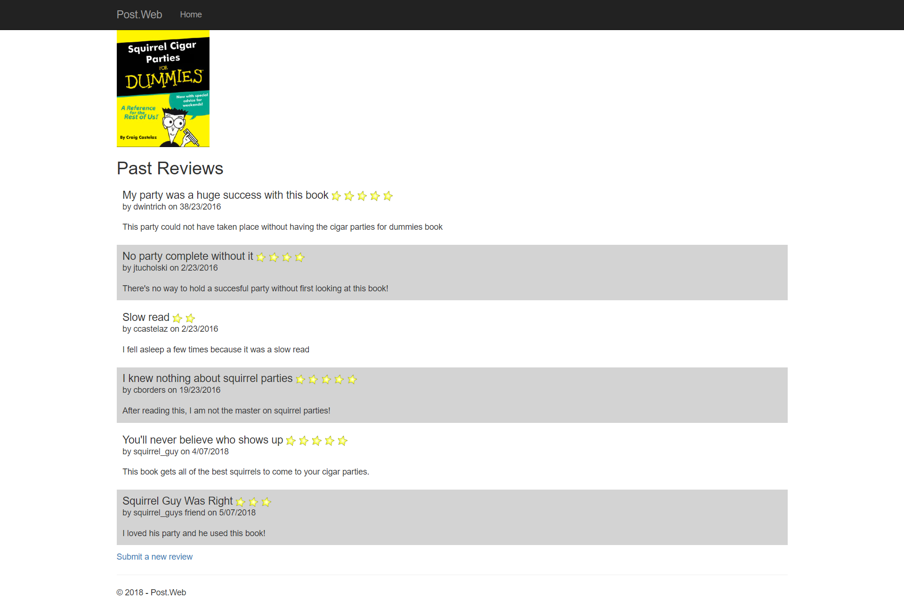

# HTTP POST Exercise

You have been tasked with developing a promotional site for the best selling book, **"Squirrel Parties for Dummies"** by Craig Castelaz.

The home page of the site should provides a list of product reviews submitted from the web. The application should: 

1. Provide a page that allows a site user to submit a new review
2. Display previously submitted reviews on the home page

## Submitting a New Review

Users can navigate to `http://localhost:xxxxx/home/newreview` to view a page that allows them to submit a new review.

The page will provide the user with the form to submit:

* Username
* Rating
* Review Title
* Review Text

* The data should be submitted via POST to `home/newreview`
* The POST request should include a request verification token to prevent CSRF
* Once the submission is received, the data should be saved in the database.
* The user should be redirected to `home/index`

## Viewing Reviews

The Home Page `home/index` allows users the ability to see any reviews that were previously submitted to the web application.

The page should display to the user all of the prior reviews. You should use this wireframe as an example of how it should appear but can exercise your own visual creativity.

