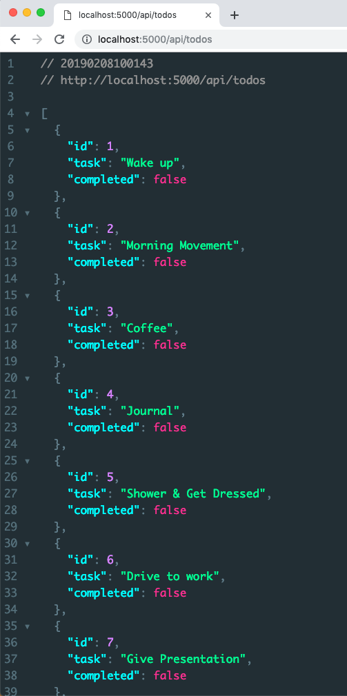
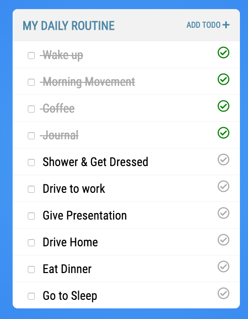

# Creating REST APIs Tutorial: .NET

In this directory you will find the folder `todo-rest-dotnet/TodoAPI` that contains the starter code for this tutorial. Everything you need to create this application is already in place. The only think you will be building in this tutorial is the controller.

## Starter Code

Before you dive in and create the controller it will help if you understand how this application works. In the namespace `TodoAPI.Models` you will find the class `Todo.cs`. This is a simple class that just contains 3 properties.

```csharp
namespace TodoAPI.Models {

    public class Todo {

        public int id {get;set;}
        public string task {get;set;}
        public bool completed {get;set;}

    }

}
```

In the namespace `TodoAPI.Services` you will find the class `DataAccessLayer.cs` which implements the interface `IDataAccessLayer.cs`. Normally the Data Access Layer would talk to a database but to keep this application simple you are just going to use a List to store the todos in memory. In the constructor you will initialize the list with 10 tasks.

```csharp
public class DataAccessLayer : IDataAccessLayer<Todo>
{
	public List<Todo> todos { get; set; }

	public DataAccessLayer()
	{
		this.todos = new List<Todo> {
			new Todo {id=1,task="Wake up",completed=false},
			new Todo {id=2,task="Morning Movement",completed=false},
			new Todo {id=3,task="Coffee",completed=false},
			new Todo {id=4,task="Journal",completed=false},
			new Todo {id=5,task="Shower & Get Dressed",completed=false},
			new Todo {id=6,task="Drive to work",completed=false},
			new Todo {id=7,task="Give Presentation",completed=false},
			new Todo {id=8,task="Drive Home",completed=false},
			new Todo {id=9,task="Eat Dinner",completed=false},
			new Todo {id=10,task="Go to Sleep",completed=false}
		};
	}
}
```

You will use the data access layer in your controller. It is important to note that when your application starts up it reads the data into memory (List<Todo> todos) so all the changes at runtime are in memory. This means that when you restart the application the data will be reset.

## Creating the REST Controller

The first thing you need to do is to create a new class `TodosController.cs` in the namespace `TodoAPI.Controllers`.

```csharp
namespace TodoAPI.Controllers
{
    [Route("api/[controller]")]
    [ApiController]
    public class TodoController : ControllerBase
    {

	}
}
```

* [Route("api/[controller]")] - Attribute-based routing. This allows us to override the default routing mechanism provided by ASP.NET MVC by forcing clients to navigate to http://localhost:5000/api/todos to access our API. It is not specific to API Controllers.
* [ApiController] - The ApiController attribute is used to inform the MVC framework how it should expect requests and responses to be constructed. This mainly benefits us by automatically serializing & deserializing our content to/from JSON.
* ControllerBase - This base class is inherited from Controller (the class we used in server-side MVC). It provides many reusable methods that we will need without the support for a view.

Next we need to get an instance of our `DataAccessLayer.cs` class as it contains all of the CRUD operations to perform on our in memory list of todos. Create a new private property called `dal` of type `DataAccessLayer`. You can then add this as a dependency in the constructor and MVC will give you an instance.

```csharp
private DataAccessLayer dal;

public TodosController(DataAccessLayer dataAccessLayer) {
	dal = dataAccessLayer;
}
```

> #### Note::Dependency Injection
>
> Dependency Injection works the same as it does in Server-Side MVC. The dependencies are managed in the `Startup.cs` file. If a constructor argument is defined for which a dependency match exists, the concrete class will be *injected* in at run-time.


## List Todos

Now that you have the basic controller created you can focus on created each of the methods you need to make this application work. The first thing you need to do is add an endpoint where you can get a list of all the Todos. The `DataAccessLayer.cs` class already has a method that will return a list of Todos. `[HttpGet]` matches the request method GET when the path is `/api/todos`.

```csharp
[HttpGet]
public List<Todo> GetAll()
{
	return dal.GetAll();
}
```

* `[HttpGet]` Matches actions on `GET` requests, to retrieve resources

## Add Todo

Next you need to handle a post request to add a new Todo. The `[HttpPost]` attribute tells the method that this will be called when the request method is POST and the path is `/api/todos`. `CreatedAtRoute()` is a method provided by the `ControllerBase` that generates an [HTTP 201 Status Code Response](https://httpstatuses.com/201) class allowing the API the ability to inform the client where to go next to see the *created resource*.

```csharp
[HttpPost]
public ActionResult Create([FromBody] Todo todo)
{
	dal.Add(todo);

	// Return a created at route to indicate where the resource can be found
	return CreatedAtRoute("GetTodo", new { id = todo.id }, todo);
}
```

## Read Todo

The read method will allow you to pass an id and get back just a single Todo. 

```csharp
[HttpGet("{id}", Name = "GetTodo")]
public ActionResult<Todo> GetTodo(int id)
{
	var todo = dal.Get(id);

	if (todo != null)
	{
		return todo;
	}

	return NotFound();
}
```

* [HttpGet("{id}", Name = "GetTodo")] - Indicates that an additional URL parameter will be provided and mapped to the id passed into the action. Secondly the action is given a friendly-name which can be used as a reference by other actions (see [HttpPost]).
* return todo - If we successfully locate the individual todo, it is returned.
* return NotFound() - If we are unsuccessful in locating the todo, an HTTP 404 Status Code is returned.


## Update Todo

The PUT request is used to update a resource through an API. When processing a PUT request, it is common to:

1. First look up the resource that the user is updating to ensure it exists (return an HTTP 404 if not).
2. Update the resource with the new content passed in.
3. Return HTTP 204 (No Content), indicating the server has fulfilled the request.

Implementing this logic would resemble the following:

```csharp
[HttpPut("{id}")]
public ActionResult Update(int id, Todo updatedTodo)
{
	// Get the existing todo
	var existingTodo = dal.Get(id);

	// If that todo does not exists, return 404
	if (existingTodo == null)
	{
		return NotFound();
	}

	// Copy over the fields we want to change
	existingTodo.completed = updatedTodo.completed;

	// Save back to the database
	dal.Update(existingTodo);

	// return a 204
	return NoContent();
}
```

## Delete

Last, if the API needs to support the ability to delete resources, then the `[HttpDelete]` attribute is used. The incoming request will need to somehow specify which resource to delete, usually by id.

```csharp
[HttpDelete("{id}")]
public ActionResult Delete(int id)
{
	var todo = dal.Get(id);

	if (todo == null)
	{
		// return HTTP 404
		return NotFound();
	}

	// delete the resource
	dal.Delete(id);

	// return HTTP 201
	return NoContent();
}
```


## TodoController Solution 

If you followed the tutorial correctly you should end up with a `TodosController.cs` that looks like this:

```csharp
using System;
using System.Collections.Generic;
using System.Linq;
using System.Threading.Tasks;
using Microsoft.AspNetCore.Mvc;

using TodoAPI.Models;
using TodoAPI.Services;

namespace TodoAPI.Controllers
{
    [Route("api/[controller]")]
    [ApiController]
    public class TodosController : ControllerBase
    {

        private DataAccessLayer dal;

        public TodosController(DataAccessLayer dataAccessLayer) {
            dal = dataAccessLayer;
        }

        [HttpGet]
        public List<Todo> GetAll()
        {
            return dal.GetAll();
        }

        [HttpGet("{id}", Name = "GetTodo")]
        public ActionResult<Todo> GetTodo(int id)
        {
            var todo = dal.Get(id);

            if (todo != null)
            {
                return todo;
            }

            return NotFound();
        }

        [HttpPost]
        public ActionResult Create([FromBody] Todo todo)
        {
            dal.Add(todo);

            // Return a created at route to indicate where the resource can be found
            return CreatedAtRoute("GetTodo", new { id = todo.id }, todo);
        }

        [HttpPut("{id}")]
        public ActionResult Update(int id, Todo updatedTodo)
        {
            // Get the existing todo
            var existingTodo = dal.Get(id);

            // If that todo does not exists, return 404
            if (existingTodo == null)
            {
                return NotFound();
            }

            // Copy over the fields we want to change
            existingTodo.completed = updatedTodo.completed;

            // Save back to the database
            dal.Update(existingTodo);

            // return a 204
            return NoContent();
        }

        [HttpDelete("{id}")]
        public ActionResult Delete(int id)
        {
            var todo = dal.Get(id);

            if (todo == null)
            {
                // return HTTP 404
                return NotFound();
            }

            // delete the resource
            dal.Delete(id);

            // return HTTP 201
            return NoContent();
        }

    }
}
```

## Running the Todo Application

If you run the application and visit http://localhost:5000/api/todos you should see a list of todos.



## Todo Vue Application

Now that you have your REST API working you need to update the todo application. In the folder `todo` go into `/src/components/TodoList.vue` and update the apiURL to:

```javascript
apiURL: "http://localhost:5000/api/todos",
```

Now instead of your todo application using the mock API it's using the API that you just built. If REST API is already running you can start your Todo Application:

```
npm run serve
```

If everything went ok you should be able to use your Todo app the same way you did in a previous tutorial only this time it's using your own REST API!

;
